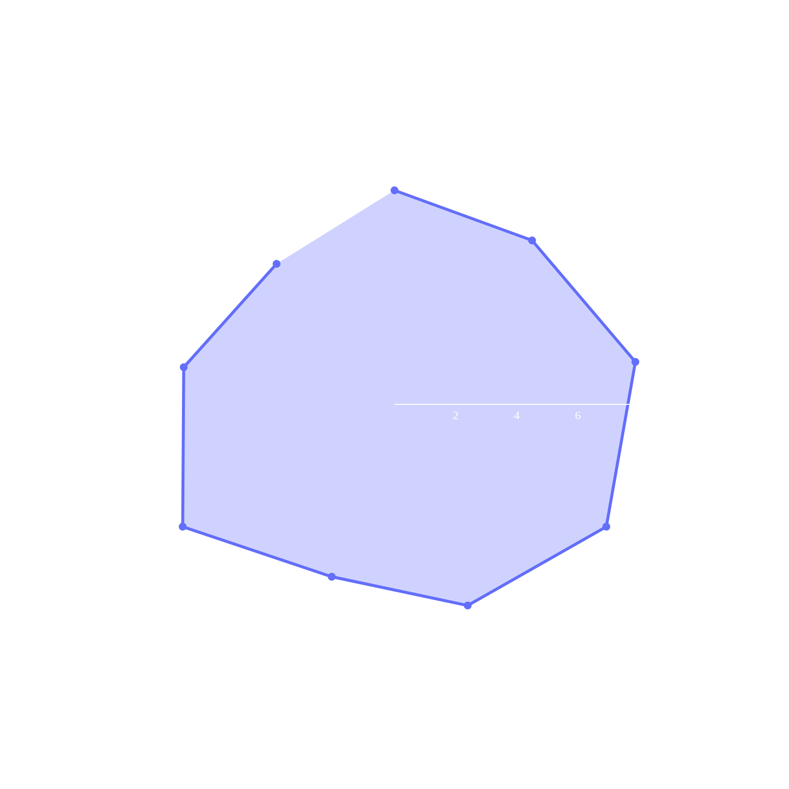

# 2025-12-12

!!! abstract "The 4:6 Recipe"
    *   **Bean:** Southern weather
    *   **Roast:** Light
    *   **Ratio:** 1:15.0 (20g In / 300g Out)
    *   **Grinder:** 32
    *   **Temp:** 93°C
    *   **Phase 1 (Balance):** 55g ➔ 65g | **Phase 2 (Strength):** 2 x 90g

## Timeline

```text
0:00   0:45   1:30   2:15   3:00
├──────┼──────┼──────┼──────┤
│  P1  │  P2  │  P3  │  P4  │
│ 55g  │ 65g  │ 90g  │ 90g  │
└──────┴──────┴──────┴──────┘
```

## Evaluation



**Total Score:** 64/90

> "用点滴最后90g的水，惊艳的是对比geometry这个的确要好喝些。虽然after taste有微弱的苦涩味"